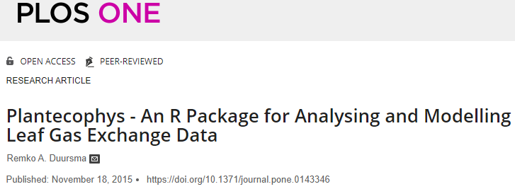

background-image: url(https://s2.ax1x.com/2020/03/09/8S2l7T.png)

background-size: cover

class: left middle

# 主要内容

### .black.medium.bold[1 package 介绍]
### .black.medium.bold[2 数据的准备]
### .black.medium.bold[3 数据的拟合]
### .black.medium.bold[4 结果的查看与导出]
---
class: inverse center middle

# `plantecophys` 介绍

---
# `plantecophys` 作者

.center.blue[[https://remkoduursma.github.io/plantecophys/](https://remkoduursma.github.io/plantecophys/)
]

```{r}

```

---
# 软件包的科学背景

```{r}

```
---

