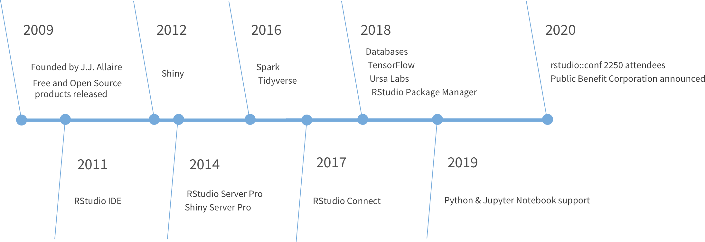

background-image: url("https://s1.ax1x.com/2020/03/30/GmT0oT.png")

class: inverse, left, middle, animated, fadeIn

# 1. R 软件

# 2. Rstudio

# 3. Rstudio 的基本操作
---
background-image: url("https://s1.ax1x.com/2020/03/30/Gmbxk6.png")
background-position: center
background-size: contain

class: middle, center, animated, fadeIn

<br />
<br />
<br />
<br />
<br />
# .large.bold.blue[人生苦短，我用 R]

---
class: animated, fadeIn

# R 软件 

R 是一款专用于统计计算和图形的自由软件，是由统计学家编写的软件。

- 免费

- 非常多的软件包支持 ([pakcages](https://mirrors.tuna.tsinghua.edu.cn/CRAN/))

- 跨平台

- 简单易学

---
class: animated, fadeIn

# Rstudio

> RStudio’s mission is to create free and open-source software for data science, scientific research, and technical communication. 

.large.bold.tomato[其出品的 Rstudio 软件则是用 R 写代码的最佳搭档！]

```{r}

```


---
class: animated, fadeIn

# R 和 Rtudio 软件的下载


.pull-left[
### R

- [Windows](https://mirrors.tuna.tsinghua.edu.cn/CRAN/bin/windows/)
- [macOS](https://mirrors.tuna.tsinghua.edu.cn/CRAN/bin/macosx/)
- [Linux](https://mirrors.tuna.tsinghua.edu.cn/CRAN/bin/linux/)
]

--
.pull-right[

### RStudio: 

- [Download](https://www.rstudio.com/products/rstudio/download/#download)
]

<br />
<br />
.blue[R 软件是具体执行分析的软件， Rsutdio 则为我们写代码的一个环境。即 R 是具体执行代码，进行分析工作的部分，是核心部分，我们可以没有 Rstudio，但不能没有 R，Rsutido 使我们能够更方便的进行代码编写。]
---
class: animated, fadeIn


## RStudio 使用

.pull-left[

```{r}
include_graphics("http://www.sthda.com/sthda/RDoc/images/rstudio.png")
```
]

--
class: animated, fadeIn

.pull-right[

### 快捷键

- ctrl + enter (运行选择的区域/行)

- ctrl + alt + R (运行所有代码)

- 方向键 (自动补全)

- ctr+shift+f10 (重启 R)

]
---
class: inverse, middle, center, animated, fadeIn

.large.bold[# R 的安装演示]


---
class: inverse, middle, center, animated, fadeIn

.large.bold[# Rstudio 的安装及简单介绍演示]


---

class: center, middle

# 谢谢
```{r}

```
