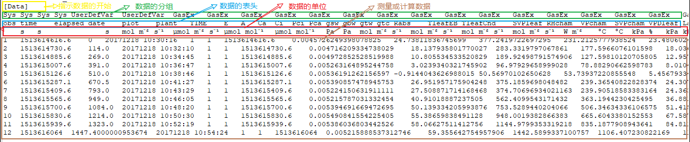
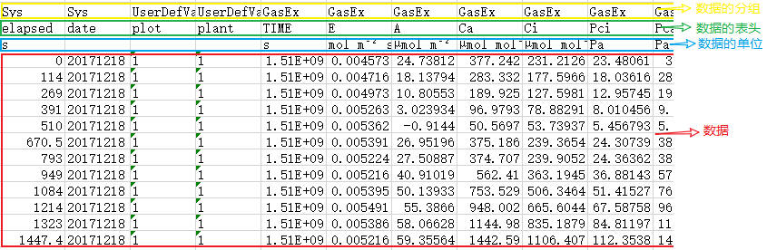
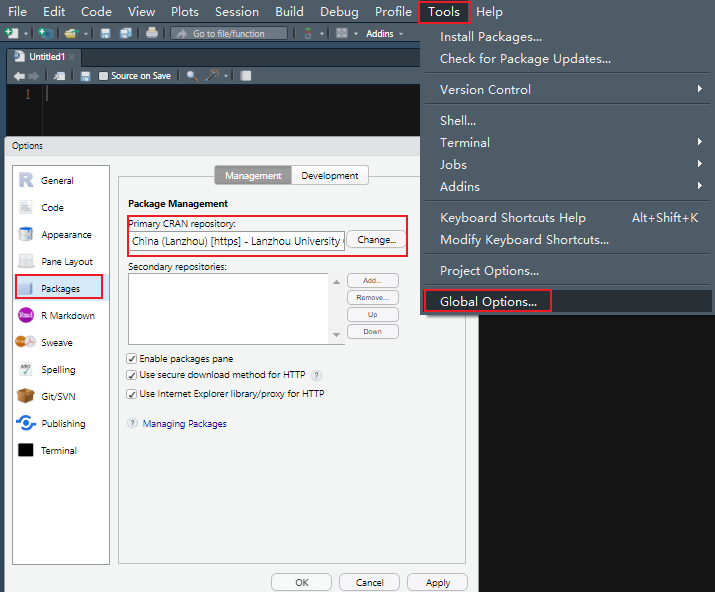
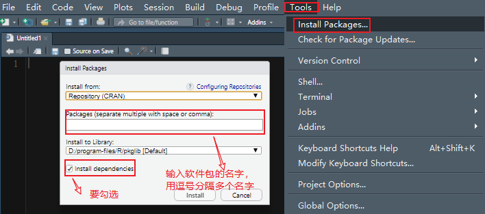

background-image: url("https://s1.ax1x.com/2020/03/30/GmT0oT.png")

class: inverse, left, middle, animated, fadeIn

# 1. LI-6800 数据的格式

# 2. 文件格式的转换

# 3. 软件包的安装

# 4. 读取 csv 文件

# 5. 读取原始文件和 Excel 文件

---
class: inverse, middle, center, animated, fadeIn

# .large.bold[LI-6800 的数据格式]

---
class: animated, fadeIn
# 原始数据

LI-6800 的原始数据不带任何后缀，为 tab 分隔符分隔的纯文本文件，可以使用**任何的文本编辑器（推荐 notepad++）**打开。

```{r}

```

**目前并不推荐初次使用 R 就读取 LI-6800 原始数据文件**
---
class: animated, fadeIn

# excel 数据

LI-6800 的 excel 数据是标准的 excel 文件，内含大量的公式，方便我们直接修改某些参数而进行重计算。

```{r}

```

**虽然 excel 数据对人类阅读比较友好，但目前流行的 `tidyverse` 中的 `read_excel` 并不支持其中的公式读取** ，需要 `XLConnect` 软件包才可以，需要安装 [JRE](https://java.com/en/download/) 支持。
---
class: inverse, center, middle, animated, fadeIn


# .large.bold[软件包的安装]


---
class: animated, fadeIn
# 图形界面安装 CRAN 软件包
.pull-left[
```{r, fig.retina=2}

```
]

.pull-right[

<br />
<br />
<br />

```{r, fig.retina=2}

```
]
---
class: animated, fadeIn
# 命令安装软件包

.large.bold[- 安装 CRAN 软件包]


```r
install.packages("packages")
# 或
install.packages(c("packages1", "packages2", "..."))
```

.large.bold[- `remotes` 安装其他来源的软件包]

例如：

```r
remotes::install_github("repo name")
remotes::install_bitbucket("repo name")
remotes::install_git("url")
```

---
class: inverse, center, middle, animated, fadeIn


# .large.bold[读取数据文件]

---
class: animated, fadeIn

# 读取 csv 文件

## R 有许多与读取 csv 文件相关的函数,例如常用的：

```r
utils::read.csv
readr::read_csv
data.table::fread
```

## 其它 ......

---
class: animated, fadeIn

# 读取原始数据和 Excel 文件

## 原始数据文件：

1. 直接使用 `read.delim` 读取 tab 分隔符的数据，因数据格式的原因，需要读取两次，以获得表头和数据。

2. 使用 `readphoto::regex_read` 直接读取

--
## Excel 数据文件：

使用 `readphoto::xlconnect_read`


---
class: inverse, center, middle, animated, fadeIn

# .large.bold[数据读取的演示]
---
background-image: url("https://s1.ax1x.com/2020/04/02/GJimlV.png")
background-size: contain
