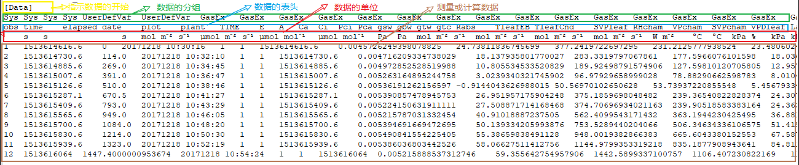

background-image: url("https://s1.ax1x.com/2020/03/30/GmT0oT.png")

class: inverse, left, middle, animated, fadeIn

# 1. 光响应曲线的模型

# 2. 模型的拟合

# 2. 补偿点和饱和点的计算

# 3. 代码演示
---
class: inverse, middle, center, animated, fadeIn

# .large.bold[光响应曲线的模型]

---
class: animated, fadeIn
# 原始数据

LI-6800 的原始数据不带任何后缀，为 tab 分隔符分隔的纯文本文件，可以使用**任何的文本编辑器（推荐 notepad++）**打开。

```{r}

```

**这是目前推荐的 LI-6800 读取的数据文件格式**
---
class: animated, fadeIn