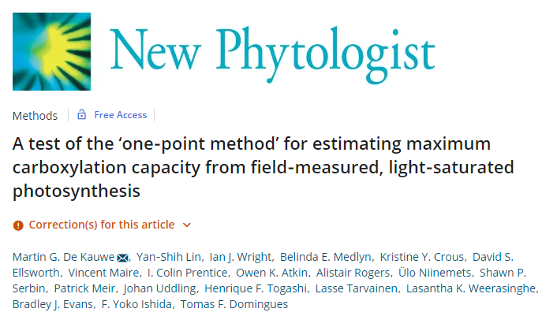
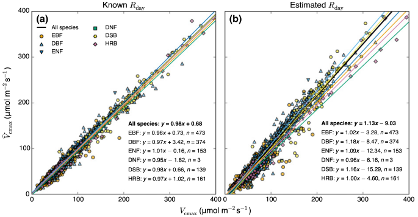

background-image: url("https://s1.ax1x.com/2020/03/30/GmT0oT.png")

class: inverse, left, middle, animated, fadeIn

# 主要内容

# 1.  one point 方法背景介绍
# 2.  one point 的理论假设
# 3.  one point 方法的拟合及演示
---
class: inverse center middle, animated, fadeIn

# .large.bold[one point 方法的背景介绍]

---
class: animated, fadeIn

# one point 方法的背景

.pull-left[

```{r, fig.retina=2}

```
]

.pull-right[

<br />
<br />
- 收集了 1394 个冠层上部叶片的 ACi 测量数据。

- 涵盖 46 个样地的 564 个 C3 物种。

- 除了一个样地使用了自制的开路系统外，其他均使用 LI-6400 测量完成。

]

---

class: inverse center middle, animated, fadeIn

# .large.bold[one point 的理论假设]

---
class: animated, fadeIn

# $\hat V_{cmax}$ 的计算

.pull-left[

计算前叶片需满足：

- 叶片处于外界大气的 $CO_2$ 浓度之下

- 叶片处于饱和光强之下

- 处于羧化速率限制阶段而不是 RuBP 再生限制阶段

这样 $\hat V_{cmax}$ 可以通过下面的公式来计算：

$$\hat V_{cmax} = (A_{sat}+R_{day})(\frac{C_i+ K_m}{C_i- \Gamma^*})$$ 

而 Km 米氏常数则为：

$$K_m=K_c(1+\frac{O_i}{K_o})$$

]

.pull-right[

在 $R_{day}$ 未知的情况下，作者按照 Collatz 等的方法，假设其为 $V_{cmax}$ 的 1.5%，那么：

$$\hat V_{cmax} = \frac{A_{sat}}{\frac{C_i- \Gamma^*}{C_i+ K_m} - 0.015}$$

若 $R_{day}$ 已知，那么可以直接带入计算，并且结果与实际 $V_{cmax}$ 具有很高的一致性，**`fitaci` 需要使用 Rd**。

]

---
class: animated, fadeIn


# $\hat J_{max}$ 的计算

假设为 $J_{max}$ 与 $V_{cmax}$ 是有很强的相关性的， 实际上众多文献也证实了该点，one point 这篇文章中的比值均值为 1.9，范围在 1.68 ~ 2.14 之间。我们也可以提前测量或使用历史数据得到。

-----

**.large.bold[注意:]**

该方法需要最所测量物种有非常深的了解，例如：

- Ci transition 浓度，否则无法保证外界浓度二氧化碳下植物是否处于 Rubisco 限制阶段。

- 准确的 $R_{day}$ 测量有助于提升结果的可靠性。

- 准确的 Vcmax 与 Jmax 的比例有助于 Jmax 的准确性，不过二者的比例一般都会在 2 左右。

- 植物要确保处于饱和光强的照射之下，并且需要诱导。

- 适合大批量的快速判定同一种的 Vcmax 或 Jmax

---
class: animated, fadeIn

# 拟合方法

.pull-left[
拟合还是需要 `fitaci` 函数，正确的函数写法至少要包含下面的参数：

```r
fit <-
  fitaci(
    aci,
    varnames = list(
      ALEAF = "A",
      Tleaf = "Tleaf",
      Ci = "Ci",
      PPFD  = "Qin",
      Rd = "Rd"
    ),
    fitmethod = "onepoint",
    useRd = TRUE
  )
```
第一个问题是表头必须使用 LI-6800 的格式。
]

.pull-right[

<br />
`fitaci` 的计算要求输入 Rd，因此 `useRd = TRUE` 是必须的，拟合的方法自然是要选择 ‘onepoint’。

```{r}

```

]

---
class: animated, fadeIn

# 结果的查看

使用 onepoint 方法计算的结果不同于其他的两种拟合方法，该方法返回一个 data frame，所以我们如果需要,直接将数据保存到电脑即可，当然，也可以只保存 $J_{max}$ 与 $V_{cmax}$ 两列数据。

例如使用 `write.csv` 将数据保存到本地：

```r
write.csv(fit, file.choose())
```
如果仅需要 $J_{max}$ 与 $V_{cmax}$ 两列数据，那么他们会在保存的 csv 格式的最后两列，我们可以手动删除其他列，或者先将两列数据单独存为 data.frame 后保存:

```r
df <- data.frame(vcmax = fit$Vcmax, jmax = fit$Jmax)
write.csv(df, file.choose())
```
---
class: animated, fadeIn

background-image: url("https://s1.ax1x.com/2020/04/02/GJimlV.png")
background-size: contain

