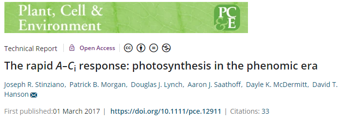
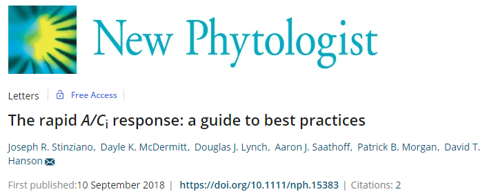
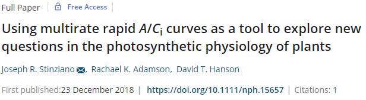
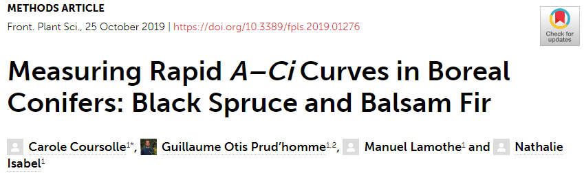
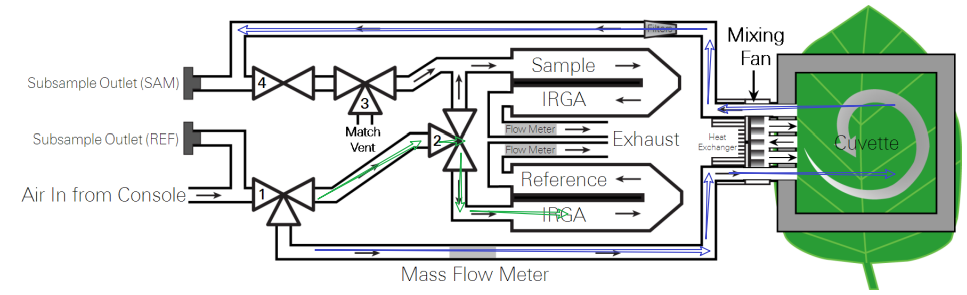
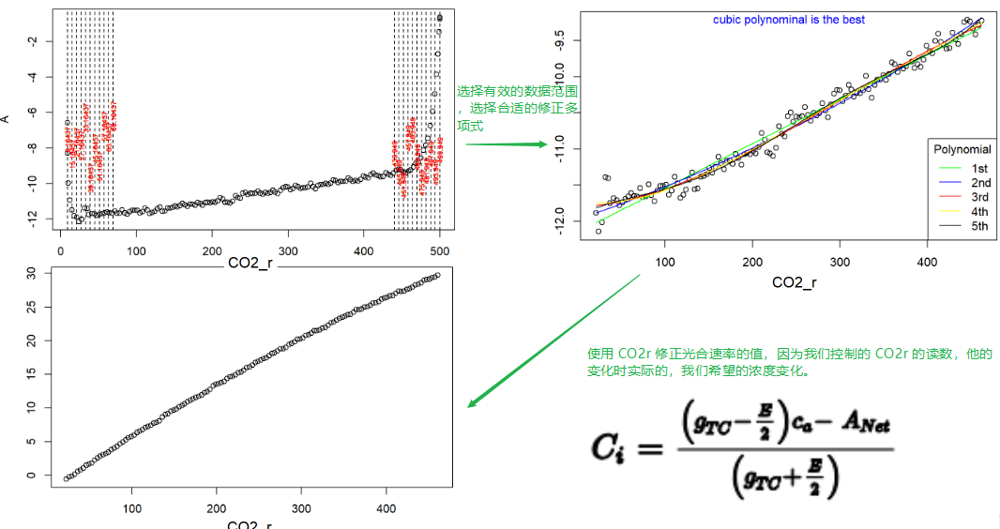
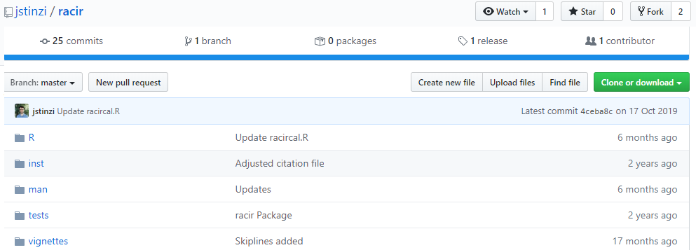
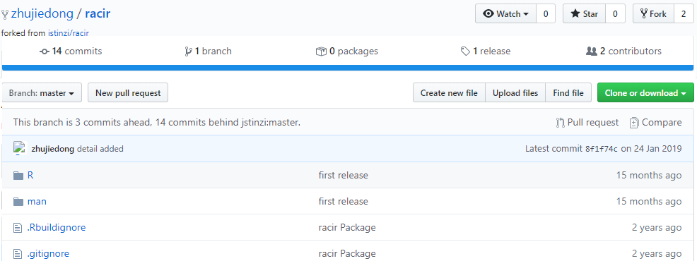
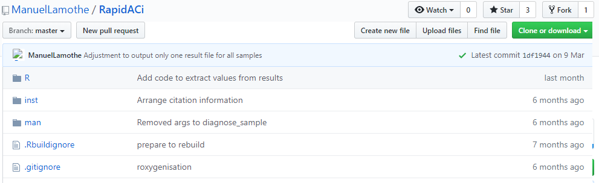

background-image: url("https://s1.ax1x.com/2020/03/30/GmT0oT.png")

class: inverse, left, middle, animated, fadeIn

# 主要内容

# 1.  关于 RACiR 方法的几个研究
# 2.  RACiR 的数据处理
# 3.  RACiR 的拟合及演示
---
class: inverse center middle, animated, fadeIn

# .large.bold[关于 RACiR 方法的几个研究]

---
class: animated, fadeIn

# RACiR 的理论前提

.bold.purple.large[
有研究表明，尽管外界条件有大的  $CO_2$  变化，进入叶片细胞液的 $CO_2$ 在溶解和 Rubisco 的 羧化下，在小于 1 s 的时间内能达到表观的稳定状态。这意味着当叶片外部 $CO_2$  浓度的变化，叶片能在短时间内至少达到一个准稳态。表明采用快速的 $CO_2$ 变化来测量标准方式的 ACi  的参数是可能的。]

<br />
.large.bold[
Laisk A. & Oja V. (1998) Dynamics of Leaf Photosynthesis: Rapid‐response Measurements and Their Interpretations. CSIRO, Collingwood, VIC, Australia.
]


---
class: animated, fadeIn
# RACiR 的起源

```{r}

```

Stinziano 等鉴于传统 ACi测量时存在的缺点：**时间长，一条曲线至少需要 20 – 30 min，样本大时，单台仪器使用这种方法几乎没有可行性；
整个测量过程中，时间长，酶的激活状态的变化，叶绿体的移动，气孔的开度的变化等导致前后不一致**，开创性的运用了 RACiR 方法进行测量，得到有效的 Vcamx 和 Jmax 的数据。
---
class: animated, fadeIn
# 关于 RACiR 最佳实践的指导
```{r}

```
---
class: animated, fadeIn
# 关于 RACiR 研究新问题的探讨
```{r}

```
- 揭示传统的 ACi 方法无法实践的光合特性研究（快速的 $CO_2$ 变化）；

- 验证光呼吸的代谢滞后性与扩散限制的相关性；

- 光呼吸导致了 RACiR 对二氧化碳补偿点计算的偏差，扩散限制降低了叶绿体二氧化碳浓度的变化速率。
- RACiR 在计算扩散限制和光呼吸速率上非常有帮助。
---
class: animated, fadeIn
# 关于簇状叶或针叶的测量的指导
```{r}

```
- 使用大叶室做 RACiR 测量完全可行。 
- 使用全范围的的和部分范围的 RACiR 计算的 Vcmax 和 Jmax 均与传统的 ACi 无差别。
- RACiR 二氧化碳的补偿点较 ACi 略高，但差异不显著（p=0.06）
- RACiR 对 Rd 的计算要优于 ACi 方法
---
class: animated, fadeIn
# 一些关键的注意事项

- 匹配问题：空叶室校准的数据和 RACiR 测量的数据必须是同一个系列，换句话说，如果匹配了分析器就要重新做空叶室校准。

- 匹配的时间间隔问题：根本的判定标准是 MchStatus 内的 MatchCO2 和 MatchH2O 有无变化，若无变化可以不用匹配，间隔时间长了未必不好，当然，对于新版本（BLUE>1.4.02）的 range match 来讲，匹配更准确，匹配间隔可以更长。

- $CO_2$ 的变化速率，多数情况下使用 100 ppm/min 的速率是合理的

- 记录时间间隔，若采用部分量程测量，可以使用 1 Hz 来计数，如果使用全范围的测量，可以使用 2 Hz。

- 使用测量的 Rd 值能有效的提高 Vcmax 和 Jmax 的准确性。

- 测量前一定要做预实验确定最佳的二氧化碳的变化速率和合适的浓度范围。

- 浓度控制的是 Reference 分析器的浓度。

---
class: inverse center middle, animated, fadeIn

# .large.bold[关于 RACiR 方法的数据处理]

---
class: animated, fadeIn
# 为什么做空叶室校正

```{r}

```

因为 Sample 气路体积更大，在气体浓度的上升过程中，Reference 上升的速度远高于 Sample，空叶室下也会有一个极大的，不断变化的光合速率存在，我们要修正因为体积差异导致的计算差异，确保差异都来自于叶片，而不是气路的大小。

---
class: animated, fadeIn
# 如何修正气路大小不同的差异

```{r, fig.retina=2, fig.align='center'}

```

利用 $CO_2R$ 修正 A，此时的 gtc 和 E 不变，我们带入上面多项式计算出来的系数，即可得到真正的光合速率。
---
class: inverse center middle, animated, fadeIn

# .large.bold[关于 RACiR 数据的拟合]

---
class: animated, fadeIn

# Stinziano 的 racir 软件包

网址：[https://github.com/jstinzi/racir](https://github.com/jstinzi/racir)

```{r, fig.retina=2, }

```

<br />
- 只支持原始数据格式

- 有一个循环写的批量处理的命令

因手头暂无原始数据，此方法不再演示，与下面提到的修改的 racir 包相似。

---
class: animated, fadeIn

# 修改的 Stinziano 的 racir 软件包

网址：[https://github.com/zhujiedong/racir](https://github.com/zhujiedong/racir)

```{r, fig.retina=2, }

```

**fork 的 Stinziano 的 repo，但删掉了大部分的函数，只保留了空叶室校准的函数，以及增加了一个显示开始和结束部分数据点参考线的图，以方便选择有效的数据点。批量处理无需专门使用函数，目前手头上无大量的数据，因此大量数据的处理的代码请参考：[RACiR](http://zhu_jie_dong.gitee.io/photoanalysis/anay-6800.html#racir68_exam)，此时无法演示。

---
# Lamothe 的软件包

网址：[https://github.com/ManuelLamothe/RapidACi](https://github.com/ManuelLamothe/RapidACi)

```{r, fig.retina=2, }

```

- 考虑的比较全面

- 自动化的程度很高

- 软件包的依赖较多，大量依赖 tidyverse 和 JRE
---
# 全手动计算过程

假若软件包的安装或者使用过程中遇到难以解决的问题，可采用最原始的手动分析方法：

[RACiR 手动分析](http://zhu_jie_dong.gitee.io/photoanalysis/anay-6800.html#racir68_exam)

比较适合掌握 RACiR 的分析和了解上面提到的的软件包，本质上是一个思路走下来的，为方便大家理解 RACiR，我们会先演示该方法分析 RACiR 的数据。
---
class: inverse center middle, animated, fadeIn

# .large.bold[RACiR 拟合的演示]
---
class: animated, fadeIn

background-image: url("https://s1.ax1x.com/2020/04/02/GJimlV.png")
background-size: contain

